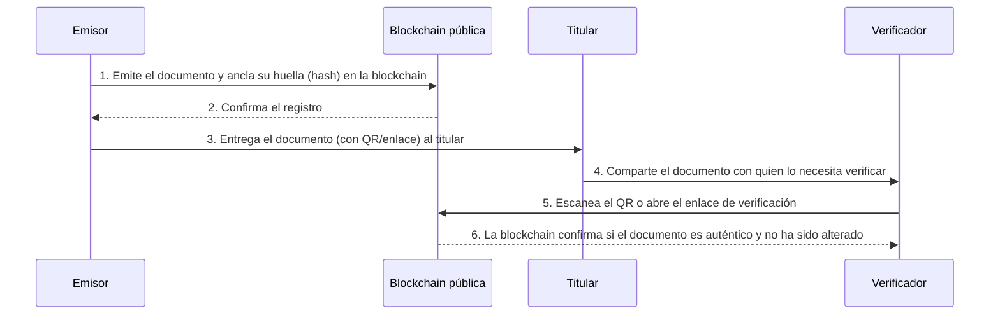
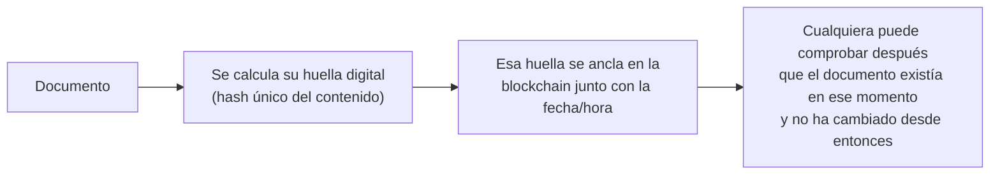
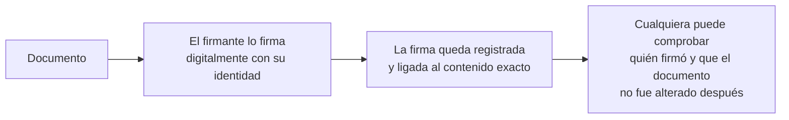
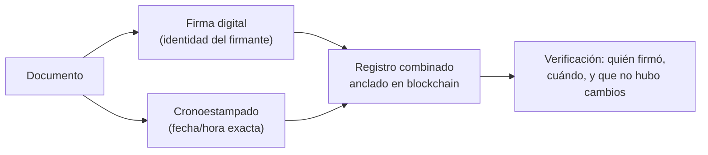

# Qedify

**Qedify — Queda demostrado.**

> El nombre viene de *Q.E.D.* (*quod erat demonstrandum*, "queda demostrado") + el sufijo *-ify*.

Qedify es una plataforma para **emitir y verificar documentos digitales en blockchain**. Cada documento emitido queda registrado como una huella digital (o token) anclada en una blockchain pública, de modo que:

- **No pueda ser falsificado ni alterado** por terceros.
- **Cualquier persona con internet pueda comprobar su autenticidad en segundos**, escaneando un código QR o abriendo un enlace.
- **Siga siendo verificable aunque la institución emisora cambie de sistema o desaparezca.**

Equipo y mercado inicial: Colombia (Medellín), con proyección a Latinoamérica.

---

## ¿Qué problema resuelve?

Hoy, verificar si un certificado, diploma o acreditación que alguien presenta es real y no ha sido alterado es un proceso **lento, manual y distinto para cada entidad emisora**. Quien necesita verificar (una empresa, una universidad, otra entidad) debe contactar directamente a la institución que emitió el documento, muchas veces por correo o llamada, y esperar días. Si la institución desapareció o cambió de sistema, el documento queda sin forma confiable de comprobarse, y se abre la puerta a que alguien presente un certificado falso sin que nadie lo detecte a tiempo.

El detalle completo del problema, la evidencia y la hipótesis de por qué blockchain aporta valor aquí está documentado en [docs/semana1/ProblemBrief.md](docs/semana1/ProblemBrief.md).

## ¿A quién va dirigido?

Qedify tiene cuatro tipos de usuarios:

| Actor | Quién es | Qué hace en la plataforma |
|---|---|---|
| **Emisor** | Institución educativa, empresa u organizador de eventos | Crea plantillas de documentos, carga titulares y emite documentos en lote |
| **Titular** | Persona que recibe el documento | Ve, descarga y comparte su documento (por ejemplo, en LinkedIn) |
| **Verificador** | Cualquier persona o empresa que quiere comprobar un documento | Escanea un QR o abre un enlace, sin necesitar cuenta ni billetera cripto |
| **Administrador de la plataforma** | Equipo de Qedify | Gestiona emisores, planes de suscripción y soporte |

## Beneficios

- **Para el emisor:** emite certificados en lote de forma digital, sin depender de procesos manuales de verificación posteriores para cada titular.
- **Para el titular:** tiene sus documentos en un solo lugar, sin miedo a perderlos ni tener que volver a tramitar copias ante la entidad emisora.
- **Para el verificador:** confirma la autenticidad de un documento en segundos, sin crear una cuenta ni contactar directamente a la institución emisora.
- **Para todos:** el documento sigue siendo verificable en el tiempo, incluso si la institución que lo emitió cambia de sistema o deja de operar.

## Cómo funciona (flujo actual — Fase 1)

No se necesita cuenta ni billetera cripto para verificar: el verificador solo escanea el QR o entra al enlace y obtiene la respuesta en segundos.

## Alcance por fases

Qedify se construye por fases. **La Fase 1 es el MVP actual**; las siguientes son el roadmap, aún no implementado:

| Fase | Qué incluye | Estado |
|---|---|---|
| **Fase 1** | Emisión y verificación de certificados de cursos, diplomados y asistencia | 🟢 MVP actual |
| **Fase 2** | Carnés institucionales y credenciales de membresía | 🔜 Futuro |
| **Fase 3** | Cronoestampado de documentos | 🔜 Futuro |
| **Fase 4** | Firma digital de documentos | 🔜 Futuro |
| **Fase 5** | Otros servicios de confianza digital | 🔜 Futuro |

A continuación se explican las fases 3 y 4, ya que introducen conceptos que no todo el mundo conoce.

### Fase 3 — Cronoestampado (timestamping)

**¿Qué es?** Es una forma de demostrar que un documento **existía en un momento exacto en el tiempo**, y que desde entonces no ha cambiado. Es como si alguien sellara un sobre con una fecha y hora oficial: nadie puede abrirlo y cambiar el contenido sin que se note, ni puede fingir que lo selló antes o después de cuando realmente lo hizo.

**¿Para qué sirve?** Por ejemplo, para demostrar que una idea, un contrato o un documento ya existía en una fecha determinada, sin depender de que un tercero (como un notario) lo certifique manualmente.

### Fase 4 — Firma digital de documentos

**¿Qué es?** Es el equivalente digital de firmar un documento a mano, pero con una garantía mucho más fuerte: permite comprobar **quién firmó** el documento y que **nadie lo modificó** después de la firma. A diferencia de una firma escaneada (que cualquiera puede copiar y pegar en otro documento), una firma digital está matemáticamente ligada al contenido exacto del documento.

**¿Para qué sirve?** Para dar validez legal y de identidad a contratos, actas o cualquier documento que necesite un firmante verificable, sin necesidad de papel ni presencia física.

### Fase 5 — Firma digital + cronoestampado

**¿Qué es?** Es la combinación de ambos servicios: un documento que demuestra **quién lo firmó** (firma digital) **y en qué momento exacto** lo hizo (cronoestampado), de forma inalterable.

**¿Para qué sirve?** Para los casos que exigen el nivel más alto de confianza, por ejemplo, un contrato legal donde importa tanto la identidad del firmante como la fecha exacta en que se firmó, sin posibilidad de que alguna de las dos cosas se manipule después.

---

## Documentación del proyecto

- [Propuesta individual — Sergio Martinez Marin](docs/semana1/SergioMartinezMarin.md)
- [Problem Brief](docs/semana1/ProblemBrief.md)
