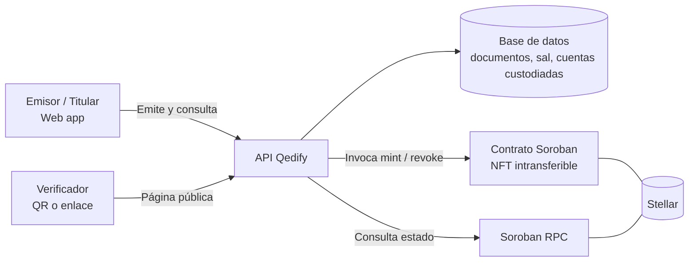

# Product Blueprint

**Nombre del proyecto:** Qedify

**Repositorio (enlace obligatorio):** [Qedify](https://github.com/sergiotechx/Qedify)

> Los campos marcados como *enlace obligatorio* deben ir como enlace en Markdown, con este formato: `[texto del enlace](https://...)`. Reemplacen el texto y la dirección de ejemplo.

---

## Contenido

1. Priorización de historias
2. Propuesta de valor
3. Flujo de usuario
4. Alcance del MVP
5. Lean Canvas
6. Backlog priorizado (Kanban)
7. Arquitectura inicial
8. Uso de Stellar y justificación

---

## 1. Priorización de historias

> Historias elegidas entre las que propuso el equipo y criterio con que se priorizaron. Son las que pasan al backlog. Extensión: breve.

**Criterio de priorización:** MoSCoW, medido contra el recorrido mínimo emisor → titular → verificador. Imprescindible (Must): sin ella el MVP no demuestra el valor. Debería (Should): mejora la confianza u operación, pero se puede entregar después.

| Prioridad | Historia | Propuesta por | Por qué entra al backlog |
| :---: | --- | :---: | --- |
| 1 | Como emisor quiero emitir un certificado a un titular como credencial NFT intransferible para que no pueda ser falsificado ni traspasado. | Sergio Martinez Marin | **Must.** Sin emisión no hay credencial que verificar; es donde se acuña el NFT en Stellar. |
| 2 | Como verificador quiero escanear un QR o abrir un enlace para confirmar en segundos si un documento es auténtico, sin cuenta ni billetera. | Sergio Martinez Marin | **Must.** Es el valor central y ataca la fricción 1 del Problem Brief. |
| 3 | Como titular quiero ver mi certificado y compartirlo con un enlace o QR para demostrar mi acreditación sin pedir copias a la institución. | Sergio Martinez Marin | **Must.** Cierra el ciclo entre emisor y verificador. |
| 4 | Como administrador de Qedify quiero habilitar qué instituciones pueden emitir para que solo emisores legítimos generen credenciales. | Sergio Martinez Marin | **Must (versión mínima).** En el MVP basta una lista de emisores habilitados. |
| 5 | Como emisor quiero revocar un certificado emitido por error para que la verificación lo muestre como no vigente. | Sergio Martinez Marin | **Should.** Necesario para operar en real; el contrato ya lo contempla. |
| 6 | Como titular quiero copiar mi credencial a mi billetera Stellar, sabiendo que el original sigue custodiado en Qedify, para tener control directo sobre ella. | Sergio Martinez Marin | **Should.** Refuerza la propiedad del titular, pero el flujo funciona sin ella. |

*(Agreguen o borren filas según las historias que pasen al backlog.)*

---

## 2. Propuesta de valor

> Qué resultado obtiene el usuario y por qué elegiría esta solución. En qué se diferencia de cómo resuelve hoy. Conecta con el usuario del Problem Brief. Extensión: 150–300 palabras en total.

**Usuario (del Problem Brief):** Empresas, instituciones educativas y demás entidades verificadoras que deben confirmar acreditaciones en procesos de selección, admisión o contratación, y los titulares que necesitan demostrarlas sin depender de la entidad emisora.

**Resultado que obtiene:** El verificador confirma en segundos, con un QR o un enlace, si una credencial es auténtica y no ha sido alterada, sin cuenta ni billetera. El titular recibe una credencial NFT intransferible que solo él puede presentar y la comparte con un toque. El emisor entrega credenciales imposibles de falsificar sin cargar con procesos manuales de verificación.

**Por qué elegiría esta solución:** Cambia una espera de días por una respuesta inmediata y elimina el trabajo repetitivo de atender consultas. Como la credencial es un NFT en una red pública, su existencia y su estado (vigente o revocado) no dependen de que la institución siga operando ni de que responda a tiempo.

**En qué se diferencia de cómo lo resuelve hoy:** Hoy cada entidad usa su propio canal (correo, llamada, portal) o un QR aislado que solo funciona mientras su sistema exista, y el PDF puede alterarse con herramientas básicas. Qedify ofrece un único método de verificación para todos los emisores, respaldado por un token intransferible que nadie, ni siquiera Qedify, puede modificar en silencio.

---

## 3. Flujo de usuario

> Recorrido de la persona por la solución de principio a fin, roles y puntos de interacción. Diagrama o secuencia numerada. Extensión: 150–300 palabras.

| Paso | Rol | Qué hace | Punto de interacción |
| :---: | :---: | --- | --- |
| 1 | Administrador | Habilita a la institución como emisor verificado. | Panel de administración |
| 2 | Emisor | Inicia sesión e ingresa los datos del certificado (titular, curso, fecha). | Formulario de emisión web |
| 3 | Sistema | Genera el documento, calcula su hash con una sal aleatoria, lo guarda y crea la cuenta custodiada del titular si no existe. | Backend de Qedify |
| 4 | Sistema | Acuña el NFT intransferible en el contrato Soroban a nombre de la cuenta custodiada del titular, con hash, emisor y fecha. | Contrato Soroban (Stellar) |
| 5 | Titular | Recibe su credencial con QR y enlace de verificación. | Correo o pantalla del titular |
| 6 | Titular | Comparte el enlace o QR con quien necesita comprobarlo. | Enlace, QR o LinkedIn |
| 7 | Titular (opcional) | Pide copiar la credencial a su billetera; Qedify acuña un token espejo enlazado y conserva el original. | Billetera Stellar del titular |
| 8 | Verificador | Escanea el QR o abre el enlace; no necesita cuenta ni billetera. | Página pública de verificación |
| 9 | Sistema | Consulta el contrato: comprueba que el token existe, está vigente y que el hash coincide. | Backend + Soroban RPC |
| 10 | Verificador | Ve el resultado: válido / revocado / no existe, con emisor, titular y fecha. | Página pública de verificación |

---

## 4. Alcance del MVP

> Funcionalidad central separada de la deseable que queda fuera. Justificación de por qué el recorte sigue entregando valor. Extensión: 150–300 palabras en total.

| Dentro del MVP (funcionalidad central) | Fuera del MVP (deseable, para después) |
| --- | --- |
| Emisión individual de una credencial por vez | Emisión masiva en lote |
| Contrato Soroban con NFT intransferible (acuñar y consultar) | Registro de emisores y gobernanza en el contrato |
| Custodia de la credencial en cuenta de Qedify por titular | Copia a la billetera del titular (token espejo) |
| Verificación pública por QR o enlace, sin cuenta ni billetera | Verificación subiendo el archivo y respaldo del contenido en IPFS |
| Lista simple de emisores habilitados en la base de datos | Plantillas personalizables, planes de suscripción y cobro |
| Revocación básica por el emisor | Carnés (Fase 2), cronoestampado (Fase 3) y firma digital (Fases 4 y 5) |

**Por qué el recorte sigue entregando valor:** El MVP recorre de punta a punta el ciclo que define el problema: un emisor legítimo acuña una credencial NFT intransferible, el titular la comparte y cualquiera la verifica en segundos contra un registro público. Dejar fuera lote, copia a billetera y almacenamiento descentralizado reduce costo y complejidad sin quitar la promesa central. Lo recortado se suma sin rehacer lo construido, porque el contrato ya define el token, su estado y su custodia.

---

## 5. Lean Canvas

> Lienzo de una página con el modelo del producto. Extensión: enlace (obligatorio).

**Enlace al Lean Canvas (obligatorio):** [Lean Canvas de Qedify](https://htmlpreview.github.io/?https://github.com/sergiotechx/Qedify/blob/main/docs/semana2/leancanvas.html)

El lienzo está en [leancanvas.html](https://htmlpreview.github.io/?https://github.com/sergiotechx/Qedify/blob/main/docs/semana2/leancanvas.html), con la distribución clásica de nueve bloques: problema, segmento de usuarios, propuesta de valor única, solución, canales, métricas clave, ventaja diferencial, estructura de costos y flujo de ingresos.

---

## 6. Backlog priorizado (Kanban)

> Enlace al tablero en GitHub Projects, construido con las historias priorizadas, en columnas y con criterios de aceptación por tarjeta. Extensión: enlace al tablero (obligatorio).

**Enlace al tablero (obligatorio):** [Tablero Kanban en GitHub Projects](https://github.com/users/sergiotechx/projects/2)

---

## 7. Arquitectura inicial

> Cómo se conectan las partes (interfaz, lógica, Stellar) y en qué punto entra la red. Diagrama simple en imagen. Extensión: 150–300 palabras en total.

**Diagrama (imagen o enlace):**

| Capa | Componente | Qué hace |
| :---: | --- | --- |
| Interfaz | Aplicación web (panel de emisor, vista del titular, página pública de verificación) | Captura los datos de emisión, muestra la credencial con su QR y presenta el resultado de la verificación. |
| Lógica | API de Qedify y base de datos | Gestiona emisores habilitados, genera el documento, calcula el hash con sal, administra las cuentas custodiadas y firma las invocaciones al contrato. |
| Stellar | Contrato Soroban de credenciales (NFT intransferible) y Soroban RPC | Guarda cada credencial (dueño, hash, emisor, fecha, estado) y permite consultarla públicamente. |

**En qué punto entra la red:** Solo en dos momentos: al emitir o revocar, cuando la API invoca el contrato para acuñar o cambiar el estado del NFT, y al verificar, cuando consulta el contrato para confirmar existencia, vigencia y hash. El resto del sistema funciona fuera de la red, y los datos personales nunca se escriben en cadena: solo el hash con sal.

---

## 8. Uso de Stellar y justificación

> Qué componentes de Stellar usaría y por qué cada uno. Apoyado en el criterio de pertinencia del Problem Brief. Extensión: 150–300 palabras en total.

**Criterio de pertinencia (del Problem Brief):** El histórico no puede alterarse y se elimina la dependencia de un intermediario que concentra la confianza: emisores, titulares y verificadores que no confían entre sí necesitan un mismo registro que siga siendo verificable aunque el emisor desaparezca.

| Componente de Stellar | Para qué lo usamos | Por qué ese y no otra alternativa |
| --- | --- | --- |
| Contrato inteligente Soroban con interfaz de NFT (SEP-50) | Representar cada credencial como un token único, con transferencias bloqueadas (intransferible) y estado revocable. | Un activo clásico de suministro 1 no permite metadatos ni revocación flexibles; el contrato sí, y deja el registro auditable por cualquiera. |
| Cuentas custodiadas por Qedify | Ser dueñas del NFT canónico y firmar y pagar las transacciones, para que el titular no maneje cripto. | Evita la fricción de billeteras (Supuesto 1 del Problem Brief) y garantiza que siempre exista un original en Qedify. |
| Token espejo hacia la billetera del titular (fuera del MVP) | Permitir que el titular tenga una copia enlazada, sin duplicar la credencial. | Mantiene una sola fuente de verdad: revocar el canónico invalida el espejo. |
| Soroban RPC (red de pruebas en el MVP) | Consultar el estado del contrato al verificar. | Consulta pública e independiente de la base de datos de Qedify, con comisiones bajas y cierre rápido de transacciones. |
